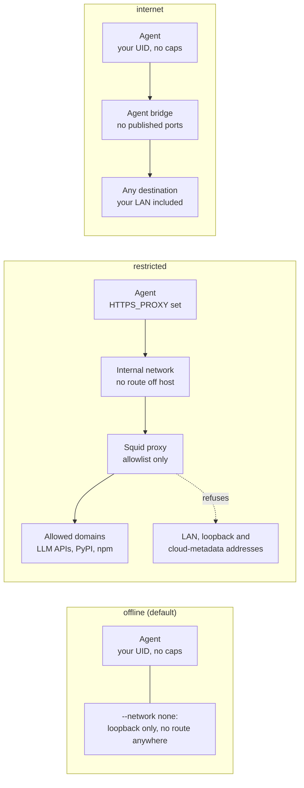

# AI agent sandbox

Every agent runs in its own hardened container, started by `agent_runner.sh`
as your normal user (it refuses root), with one writable workspace and nothing
else from your home directory.

```bash
./setup/agents/create_workspace.sh --new        # -> ~/agent-workspaces/agent-001
./setup/agents/agent_runner.sh --build-image    # builds localhost/ai-agent-base:latest
./setup/agents/agent_runner.sh \
  --workspace ~/agent-workspaces/agent-001 \
  --network restricted --memory 2g --cpus 2 \
  --env ANTHROPIC_API_KEY \
  -- python agent.py
```

| Path | Purpose |
| --- | --- |
| `~/agent-workspaces/` | Mode 0700, only you |
| `~/agent-workspaces/shared/` | Mounted read-only with `--shared` |
| `~/agent-workspaces/agent-NNN/` | One writable `/workspace` per agent |
| `~/.local/state/ai-agent-runner/audit.jsonl` | Trusted session log written by the runner on the host |
| `~/.local/state/ai-agent-runner/sessions/<id>/` | Events the agent logs about itself (untrusted) |

## Controls on every agent container

| Control | How |
| --- | --- |
| Non-root user | Your UID: `--userns=keep-id` (Podman) or `--user UID:GID` (Docker) |
| Read-only root filesystem | `--read-only`, plus a `nosuid,nodev` tmpfs at `/tmp` |
| No privilege escalation | `--security-opt=no-new-privileges` |
| No Linux capabilities | `--cap-drop=ALL` |
| Memory, CPU, processes | `--memory` with equal `--memory-swap`, `--cpus`, `--pids-limit` |
| Ceiling for all agents together | `--cgroup-parent=ai-agents.slice` (Docker) |
| Wall-clock timeout | `timeout`, then the container is killed and the kill is logged |
| Explicit mounts only | Workspace (read-write), optional shared, `--mount-ro` and secret files (read-only) |
| Default seccomp and AppArmor | Never disabled; `--privileged` is never used |

The runner refuses to mount `/`, your home directory or any folder containing a
protected path, `~/.ssh`, `~/.aws`, `~/.config`, `~/.gnupg`, `~/.kube`,
`~/.docker`, credential files, `/etc`, `/run` (which holds the Docker socket),
`/var/lib/docker`, the audit log folder, and this repository. An agent that
could edit this repository could change its own sandbox rules, or a script you
later run with sudo.

**Runtime:** `AGENT_CONTAINER_RUNTIME=auto` prefers rootless Podman, so a
container escape lands as your unprivileged user rather than root. Rootful
Docker also works but requires Docker access, and the `docker` group is
root-equivalent.

## Network modes



In restricted mode the allowlisting proxy is the only way out. Offline is the
default. In restricted mode, clients that ignore proxy settings simply fail,
which is the intent; an allowed domain can still receive anything the agent
sends.

Edit [`setup/agents/policies/restricted-allowlist.txt`](../setup/agents/policies/restricted-allowlist.txt)
(default: `api.anthropic.com`, `api.openai.com`, `pypi.org`,
`files.pythonhosted.org`, `registry.npmjs.org`), then run
`./setup/agents/network_policy.sh reload`. `network_policy.sh logs` shows every
allowed and denied request.

## Secrets

- The runner never copies your environment. `--env NAME` passes one variable, read by the container runtime from your environment, so its value never appears on a command line or in a log; only the name is recorded.
- `--secret NAME=FILE` is preferred: the file is mounted read-only at `/run/secrets/NAME` and does not show in `docker inspect`.
- [`.env.example`](../.env.example) holds placeholders only; a real `.env` is git-ignored here and globally, and should be `chmod 600`.
- From a password manager: `ANTHROPIC_API_KEY="$(pass show api/anthropic)" ./setup/agents/agent_runner.sh --env ANTHROPIC_API_KEY ...`, or `op run --env-file=agent.env -- ./setup/agents/agent_runner.sh ...`.
- Give each agent a scoped, revocable key with spending limits, and rotate any key an agent saw if it misbehaves. In production, use a secret manager issuing short-lived credentials per task.

## Auditing

The runner writes one JSON line when a session starts and one when it ends,
outside the container where the agent cannot reach it. Fields: `timestamp`,
`agent_id`, `session_id`, `tool`, `action`, `target`, `result`, `exit_code`,
`duration_s`, `runtime`, `image`, `network`, `limits`, `env_names`,
`secret_names`, `container`. The log rotates by size (`AGENT_LOG_MAX_BYTES`,
`AGENT_LOG_KEEP`).

Because that file lives in your home directory, any process running as you
could edit it. With `AGENT_LOG_TO_JOURNAL=true` (the default) each event is
also sent to the system journal, which your account cannot rewrite or delete,
and which is forwarded off the machine when remote logging is enabled:
`journalctl -t ai-agent-runner -o cat | jq .`

Inside the container, `agent_audit` (a stdlib-only Python module at
`/opt/agent-tools`, source in
[`setup/agents/tools/agent_audit.py`](../setup/agents/tools/agent_audit.py))
logs tool calls with the same fields and redacts sensitive keys, common token
formats, private keys and URL credentials. Those events are claims by the
agent, useful for debugging but not evidence. `--save-output` also keeps the
container's output (mode 0600); it is off by default because output may contain
secrets.

## Resource limits

Per agent: 2 GB memory, 2 CPUs, 256 processes and 1800 seconds by default,
overridable per run with `--memory`, `--cpus`, `--pids` and `--timeout`. All
Docker agents together are capped by `ai-agents.slice` at 50% of memory, 400%
CPU and 4096 tasks. `resource_limits.sh` also delegates CPU and IO control to
user sessions, without which rootless Podman silently ignores `--cpus`.
