# Modules

Twenty-four modules run in a fixed order: SSH before the firewall, tools
before the AIDE baseline, containers before the agent sandbox. Each runs in its
own process, so one failure is reported without stopping the rest.

```mermaid
flowchart TD
    B[bootstrap.sh] -->|runs last| R[security_report.sh]
    B --> H & D & S & A

    subgraph H[OS hardening]
        h1[updates] ~~~ h2[ssh] ~~~ h3[firewall] ~~~ h4[sysctl] ~~~ h5[apparmor] ~~~ h6[services] ~~~ h7[permissions]
    end
    subgraph D[Development]
        d1[python] ~~~ d2[node] ~~~ d3[git] ~~~ d4[containers] ~~~ d5[kubernetes *] ~~~ d6[terraform *]
    end
    subgraph S[Security tooling]
        s1[auditd] ~~~ s2[aide] ~~~ s3[container_scanning] ~~~ s4[secrets_scanning] ~~~ s5[malware_scanning *] ~~~ s6[suricata *] ~~~ s7[wazuh_agent *] ~~~ s8[log_management]
    end
    subgraph A[Agent sandbox]
        a1[resource_limits] ~~~ a2[create_workspace] ~~~ a3[network_policy] ~~~ a4[agent_runner.sh — run by you, per agent]
    end

    H & D & S & A -.-> L[("lib/: common, logging, detection, validate, report, agent<br/>every change honours dry-run, is backed up, and is recorded for rollback")]
```



`*` = off by default.

Every module changes the system only through shared helpers, which is why
dry-run, backups and the rollback manifest behave the same everywhere.
`uninstall/rollback.sh` replays that manifest.

## OS hardening

| Module | What it does | Tradeoff |
| --- | --- | --- |
| updates | Enables unattended-upgrades and the daily apt timers; removes unused kernels; no automatic reboot | Ubuntu's own security-only origin list is left untouched so it keeps receiving fixes |
| ssh | Default: stops and disables an installed sshd (never from inside an SSH session). If enabled: a drop-in with root login off, key auth, modern ciphers (ML-KEM hybrid on OpenSSH 9.9+), `MaxAuthTries 3`, validated with `sshd -t` | Password login stays on until `~/.ssh/authorized_keys` exists; TCP forwarding stays on for VS Code Remote-SSH |
| firewall | UFW deny incoming, allow outgoing, deny routed, IPv6 filtering on; a rate-limited SSH rule only when enabled; existing rules listed and contradictions warned about | Refuses to enable over SSH without confirmation; Docker and libvirt keep their own forwarding |
| sysctl | Installs a documented sysctl file, applies it key by key, records previous values, reports overriding files | See the table below |
| apparmor | Ensures AppArmor is installed, enabled and enforcing; reports profile counts | Writes no new profiles, since a wrong profile silently breaks apps |
| services | Reports non-loopback listeners; disables only `SERVICES_TO_DISABLE` (cups-browsed, legacy telnet, rsh, tftp) | Everything else is report-only |
| permissions | Tightens modes on shadow, sudoers, SSH host keys and user credential files; removes world-write under `/etc` and `/usr/local` | Only removes bits, never changes owners |

### Sysctl settings

Full comments are in
[`setup/hardening/files/60-ai-workstation-hardening.conf`](../setup/hardening/files/60-ai-workstation-hardening.conf).

| Sysctl setting | Value | Why |
| --- | --- | --- |
| `kernel.kptr_restrict`, `kernel.dmesg_restrict` | 1 | Hide kernel addresses and logs from normal users |
| `kernel.yama.ptrace_scope` | 1 | Only descendants can be traced; `gdb ./prog` still works |
| `fs.suid_dumpable` | 0 | No core dumps from setuid programs |
| `fs.protected_hardlinks`, `protected_symlinks` | 1 | Block `/tmp` link races |
| `fs.protected_fifos`, `protected_regular` | 2 | Block `/tmp` FIFO and file races |
| `net.core.bpf_jit_harden` | 2 | Harden the BPF JIT |
| `dev.tty.ldisc_autoload`, `vm.unprivileged_userfaultfd` | 0 | Remove historic exploit helpers |
| `tcp_syncookies`, `tcp_rfc1337` | 1 | SYN-flood and TIME-WAIT protection |
| redirects and source routing | 0 | The LAN cannot rewrite this machine's routes |
| `rp_filter` | 2 (loose) | Anti-spoofing that still works with VPNs |

Deliberately unchanged: `ip_forward` (Docker and VPNs need it), IPv6
`accept_ra`, unprivileged user namespaces (rootless containers, browser
sandboxes), stricter ptrace, and `kexec_load_disabled`.

## Development environment

| Module | What it does |
| --- | --- |
| python | python3, venv, pip, dev headers, build-essential, pipx; nothing pip-installed globally |
| node | Node.js 24 LTS from NodeSource, pinned above Ubuntu's older package; global npm packages in `~/.npm-global` (no `sudo npm`); TypeScript and pnpm per user |
| git | Sets `fsckObjects` and `init.defaultBranch` only if unset; adds `.env`, keys and credential files to the global ignore; warns about `credential.helper=store`; never touches SSH or GPG keys |
| containers | Docker from Docker's repository (pinned key) and/or rootless Podman; `daemon.json` merged, validated, published ports on 127.0.0.1; no docker-group membership unless configured |
| kubernetes (optional) | kubectl from pkgs.k8s.io; kind verified by SHA-256; no cluster created |
| terraform (optional) | Terraform from HashiCorp's signed repository |

The `docker` group is root-equivalent: a member can start a privileged
container that mounts `/`. Rootless Podman or rootless Docker avoids that.

Per-project Python environment:

```bash
python3 -m venv .venv && . .venv/bin/activate
pip install -r requirements.txt
```

## Security tooling

| Module | Use | Notes |
| --- | --- | --- |
| auditd | `sudo ausearch -k aiws_root_cmd -i --start today` | About 30 rules keyed `aiws_*`: sudo, su and pkexec use, root commands by logged-in users, identity and SSH config, firewall and sysctl config, systemd units, cron, `ld.so.preload`, kernel modules |
| aide | `init`, `check`, `update`, `accept` | The baseline is never auto-updated; a candidate is accepted only after review |
| container_scanning | `image`, `config`, `fs`, `deps` | Trivy, HIGH and CRITICAL by default, secrets masked |
| secrets_scanning | `scan`, `staged`, `install-hook` | Gitleaks, always `--redact`; a standalone pre-commit hook and a pre-commit-framework example |
| malware_scanning (optional) | `scan PATH`, `rootkit` | ClamAV on demand and rkhunter; signature-based, noisy after updates |
| suricata (optional) | `sudo tail -f /var/log/suricata/fast.log` | Passive IDS on the default-route interface, config tested before start, daily rule updates |
| wazuh_agent (optional) | — | Agent only, enrolled to an existing manager |
| log_management | `review [DAYS]`, `setup-sealing`, `verify` | See [Log management](#log-management) below |

## Log management

`security/log_management.sh` keeps logs long enough to investigate an incident, stops them filling the disk, and makes tampering harder or detectable.

| Control | What it does | Why |
| --- | --- | --- |
| logrotate | Installs `/etc/logrotate.d/ai-workstation` for bootstrap logs and security reports (monthly, compressed, deleted after a year); adds a Suricata policy if Suricata is enabled and has none; keeps `logrotate.timer` on | Per-run logs otherwise accumulate forever; Suricata's `eve.json` can fill a disk in days |
| journald | Drop-in with `Storage=persistent`, compression, sealing support, a 2 GB cap and 6-month retention | A volatile journal disappears at reboot, taking the evidence with it |
| auditd logs | Rotates at 50 MB and keeps 10 files; warns via syslog when space runs low; a full disk suspends auditing rather than halting the machine | Audit logs are the most valuable and the fastest-growing |
| Journal sealing (optional) | `setup-sealing` runs `journalctl --setup-keys`; `verify` checks the journal | Makes later edits to journal files detectable; the verification key is shown once and must be stored offline |
| Remote forwarding (optional) | rsyslog forwards all syslog, plus audit events via the audit syslog plugin, over TLS (port 6514) with a disk-backed queue; the config is validated with `rsyslogd -N1` before restart | The only control that survives an attacker with root, who can otherwise erase local logs |
| fail2ban (optional) | Bans an address after 5 failed SSH logins in 10 minutes, for 1 hour, via UFW | Only enabled when the SSH server is |
| Agent events in the journal | The agent runner also sends each audit event to the journal (`journalctl -t ai-agent-runner`) | Your user account can add journal entries but cannot edit or delete them |

`sudo ./setup/security/log_management.sh review 7` prints a digest for the last 7 days: failed authentications, sudo commands, UFW blocks, audit events by key, agent sessions and journal size. It shows counts and names, never message bodies that could contain secrets.
