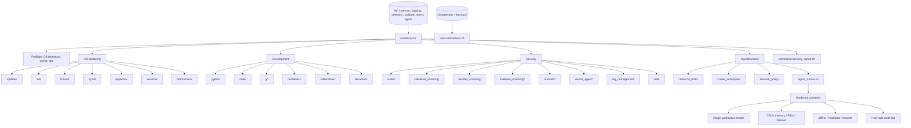

# AI Engineering Workstation Bootstrap

A repeatable, auditable setup for an Ubuntu workstation used to build and run
autonomous AI agents. It hardens the base OS, installs a development toolchain,
adds practical security tooling, and provides a **container sandbox for running
agents as untrusted code**.

```bash
sudo ./setup/bootstrap.sh --dry-run            # preview every change
sudo ./setup/bootstrap.sh                      # apply (safe to re-run)
sudo ./setup/verification/security_report.sh   # verify
```

Topic-by-topic documentation lives in [`../docs/`](../docs/README.md).

The goal is *secure enough to be useful, simple enough to maintain*. It
reduces common risks; it does not make a machine "secure", and nothing here
should be read as a guarantee.

---

## Contents

1. [Purpose](#1-purpose)
2. [Supported systems](#2-supported-systems)
3. [Threat model](#3-threat-model)
4. [Assumptions](#4-assumptions)
5. [Installation](#5-installation)
6. [Dry-run mode](#6-dry-run-mode)
7. [Configuration](#7-configuration)
8. [Modules](#8-modules)
9. [AI agent isolation model](#9-ai-agent-isolation-model)
10. [Verification](#10-verification)
11. [Rollback](#11-rollback)
12. [Known limitations](#12-known-limitations)
13. [Troubleshooting](#13-troubleshooting)
14. [Future improvements](#14-future-improvements)
15. [Repository history](#15-repository-history)

---

## 1. Purpose

Autonomous agents execute code, call APIs, browse, and handle credentials. A
model can be wrong, can be prompt-injected by content it reads, and can pull
in a malicious dependency. This project assumes **the agent is not
trustworthy** and enforces boundaries in the kernel and container runtime,
independent of what the model decides to do:

- least privilege and default deny (agents start **offline** by default)
- explicit permissions (named workspace, named secrets, named network policy)
- sandboxing, resource limits and timeouts
- audit logging that the agent cannot write to
- secret minimisation (an agent gets only the variables you name)

## 2. Supported systems

| Ubuntu | Status |
|---|---|
| 24.04 LTS (noble) | Primary target, tested |
| 22.04 LTS (jammy) | Supported |
| 26.04 LTS | Supported; third-party repos (NodeSource, HashiCorp, Trivy, ...) may lag a new release |

Requirements: systemd, AppArmor-capable kernel, x86_64 or arm64, Bash 5.
The OS is detected from `/etc/os-release`, and repository lines use the
detected codename. Other Ubuntu releases need `--allow-unsupported`. Non-Ubuntu
systems and systems without systemd are refused, and WSL gets a warning.

## 3. Threat model

**Primarily protects against:**

| Threat | Main controls |
|---|---|
| Accidental destructive agent actions | Workspace-only mounts, read-only root FS, non-root UID, timeouts |
| Agent filesystem overreach | Only the named workspace is mounted. `~`, `~/.ssh`, `~/.aws`, `~/.config`, `/`, the Docker socket and this repo are refused |
| Leaked API keys | Explicit `--env NAME` / `--secret` only, no environment passthrough, redaction in logs, Gitleaks, global gitignore |
| Malicious package dependencies | Containerised execution, venv-only Python, per-user npm prefix (no `sudo npm`), optional `ignore-scripts`, Trivy |
| Data exfiltration by an agent | `offline` default; `restricted` mode forces traffic through an allowlisting proxy |
| Accidental network exposure | UFW deny-incoming (IPv4 and IPv6), Docker ports bound to 127.0.0.1, listener review |
| Vulnerable dev services | Listener and service review, unattended security updates |
| Misconfigured containers | Report flags privileged containers, socket mounts, host network/PID, missing agent limits |
| Persistence via compromised tooling | auditd watches on systemd units, cron, `ld.so.preload`, sudoers, SSH; AIDE integrity baseline |
| Basic malware / supply-chain mistakes | Signed apt repos with fingerprint pinning where known, checksum-verified downloads, optional ClamAV/rkhunter |

**Explicitly NOT protected against:**

- kernel zero-days and container runtime escapes (a container is not a VM)
- malicious firmware, compromised hardware, physical access
- sophisticated or nation-state attackers
- unknown vulnerabilities in any installed software
- a user who runs agent code directly on the host, or approves everything

If you need hostile-code isolation, run agents in a VM or microVM (for example
Kata Containers or Firecracker) or on separate hardware.

## 4. Assumptions

- Single-user developer workstation with a desktop session, not a server.
- You run the bootstrap with `sudo` from your normal account. `SUDO_USER` is
  the "target user" for per-user steps.
- Outbound internet access is allowed. Inbound access is not needed.
- You are willing to use containers for agent execution.
- You review changes in dry-run mode before applying them to an important machine.

## 5. Installation

```bash
git clone <repository> && cd <repository>
cp setup/config/workstation.conf setup/config/workstation.local.conf   # optional overrides
sudo ./setup/bootstrap.sh --dry-run
sudo ./setup/bootstrap.sh
```

Useful options:

| Option | Effect |
|---|---|
| `--dry-run` | Show intended changes (diffs of config files, commands) without changing anything |
| `--yes` | Accept confirmation prompts (e.g. restarting Docker) in unattended runs |
| `--only firewall,sysctl` | Run selected modules |
| `--skip suricata` | Skip modules |
| `--list` | Show modules and whether they are enabled |
| `--stop-on-error` | Abort at the first failing module (default: continue, report at the end) |
| `--allow-unsupported` | Run on an untested Ubuntu release |
| `--no-report` | Skip the security report at the end |

Every module can also be run on its own, e.g. `sudo ./setup/hardening/firewall.sh --dry-run`.

**Idempotency.** Config files are compared before writing and only replaced if
different. Package installs are skipped if present. Firewall defaults are only
re-applied if they differ. A second run mostly reports `Already configured`.

**Logs.** `/var/log/ai-workstation-bootstrap/<module>-<run-id>.log` (root,
0640). Command output is captured there and passed through a redaction filter.

## 6. Dry-run mode

```bash
sudo ./setup/bootstrap.sh --dry-run
./setup/bootstrap.sh --dry-run          # works without root too; root-only state is reported as unknown
```

Dry-run prints `[DRY]` lines: unified diffs for every config file that would
change, file contents for new files, and each command that would run. It
writes nothing, not even a log file or a backup. The security report still
runs, because it is read-only.

## 7. Configuration

Everything is in [`config/workstation.conf`](config/workstation.conf).
Machine-specific overrides go in `config/workstation.local.conf` (git-ignored,
loaded after the main file). Both files are sourced as root, so the loader
**refuses** a file that is world-writable or owned by another user.

Main toggles (defaults shown):

```bash
ENABLE_AUTO_UPDATES=true      ENABLE_FIREWALL=true         ENABLE_SSH_SERVER=false
ENABLE_SYSCTL_HARDENING=true  ENABLE_APPARMOR=true         ENABLE_SERVICE_REVIEW=true
ENABLE_PERMISSION_FIXES=true  ENABLE_PYTHON=true           ENABLE_NODE=true
ENABLE_GIT=true               ENABLE_CONTAINERS=true       CONTAINER_RUNTIME=both
ENABLE_KUBERNETES=false       ENABLE_TERRAFORM=false       ENABLE_AUDITD=true
ENABLE_AIDE=true              ENABLE_CONTAINER_SCANNING=true ENABLE_SECRETS_SCANNING=true
ENABLE_SURICATA=false         ENABLE_MALWARE_SCANNING=false ENABLE_WAZUH_AGENT=false
ENABLE_LOG_MANAGEMENT=true    ENABLE_REMOTE_LOGGING=false  ENABLE_FAIL2BAN=false
ENABLE_AGENT_SANDBOX=true
AGENT_DEFAULT_NETWORK=offline AGENT_MAX_MEMORY=2g AGENT_MAX_CPUS=2 AGENT_MAX_PIDS=256 AGENT_TIMEOUT=1800
```

Heavyweight or intrusive components (Suricata, ClamAV, Kubernetes tooling,
Wazuh) are off by default.

## 8. Modules



`*` = off by default. Every module sources `lib/common.sh`. All mutations go
through `run_cmd` / `install_managed_file`, so dry-run, backups and the change
manifest work the same way everywhere.

### Base OS hardening (`hardening/`)

| Module | What it does | Why / tradeoffs |
|---|---|---|
| `updates.sh` | Installs unattended-upgrades and enables the daily periodic jobs. A separate override file removes unused kernels. Auto-reboot is off by default | The distro's `50unattended-upgrades` (security pocket only) is left untouched so it keeps receiving package fixes |
| `ssh.sh` | **Default:** if `openssh-server` is installed, it is stopped and disabled (never from inside an SSH session). **If enabled:** installs a drop-in `sshd_config.d/10-ai-workstation.conf` with root login off, key auth, modern KEX/ciphers/MACs (ML-KEM hybrid when OpenSSH ≥ 9.9), `MaxAuthTries 3`, no agent/X11 forwarding. Validates with `sshd -t` and restores the old file if invalid | Password login is only disabled once `~/.ssh/authorized_keys` exists, so you cannot lock yourself out. TCP forwarding stays on by default because VS Code Remote-SSH needs it |
| `firewall.sh` | UFW: deny incoming, allow outgoing, deny routed, IPv6 filtering on, logging low. SSH gets a rate-limited (`limit`) rule only if enabled. Existing rules are listed, and contradictory ones (SSH/80/443 open) are warned about, not deleted | Outbound traffic (browsing, apt, DNS, VPN clients) needs no inbound rules. Replies are allowed by connection tracking. Docker/libvirt manage their own forwarding. Refuses to enable over SSH without confirmation |
| `sysctl.sh` | Installs [`files/60-ai-workstation-hardening.conf`](hardening/files/60-ai-workstation-hardening.conf) and applies it key by key. Records previous values for rollback. Reports other sysctl files that override it | See the table below |
| `apparmor.sh` | Ensures AppArmor is installed, enabled and enforcing. Reports profile counts and kernel cmdline problems | No new profiles are written: a wrong profile silently breaks applications |
| `services.sh` | Lists sockets listening on non-loopback addresses. Disables only services in `SERVICES_TO_DISABLE` (default: `cups-browsed` and legacy telnet/rsh/tftp). Reports common server daemons for manual review | Guessing wrong breaks printers, VPNs or databases, so everything else is report-only |
| `permissions.sh` | Tightens modes on `/etc/shadow`, sudoers, SSH host keys, user credential files (`~/.ssh`, `~/.aws/credentials`, `~/.kube/config`, `~/.docker/config.json`, ...). Removes world-write from files under `/etc` and `/usr/local` | Only ever removes bits, never changes owners. Old modes are recorded for rollback. The shared policy lives in `lib/permissions_policy.sh` |

**Sysctl settings** (full comments in the file):

| Setting | Value | Reason |
|---|---|---|
| `kernel.kptr_restrict`, `kernel.dmesg_restrict` | 1 | Hide kernel addresses/logs from unprivileged users |
| `kernel.yama.ptrace_scope` | 1 | Only descendants can be traced; `gdb ./prog` still works |
| `fs.suid_dumpable` | 0 | No core dumps of setuid programs |
| `fs.protected_{hardlinks,symlinks}` / `{fifos,regular}` | 1 / 2 | Block /tmp link and FIFO race attacks |
| `net.core.bpf_jit_harden` | 2 | Harden BPF JIT against spraying |
| `dev.tty.ldisc_autoload`, `vm.unprivileged_userfaultfd` | 0 | Remove historic kernel exploit helpers |
| `net.ipv4.tcp_syncookies`, `tcp_rfc1337` | 1 | SYN-flood and TIME-WAIT protection |
| ICMP broadcasts / bogus errors ignored | 1 | Standard network hygiene |
| `accept_redirects`, `secure_redirects`, `send_redirects`, `accept_source_route` | 0 | The LAN must not rewrite this machine's routes |
| `rp_filter` | 2 (loose) | Anti-spoofing that still works with VPNs; strict mode breaks asymmetric routing |

Deliberately **not** changed: `ip_forward` (needed by Docker/VPNs), IPv6
`accept_ra` (needed for SLAAC), unprivileged user namespaces (needed by rootless
containers and browser sandboxes), `ptrace_scope ≥ 2` (breaks debuggers),
`kexec_load_disabled` (cannot be undone without reboot).

### Development environment (`development/`)

| Module | What it does |
|---|---|
| `python.sh` | `python3`, `python3-venv`, `python3-pip`, `python3-dev`, `build-essential`, `pipx`. Nothing is pip-installed globally. Warns if `break-system-packages` is enabled |
| `node.sh` | Node.js LTS (`NODE_MAJOR`, default 24) from the NodeSource signed repository, pinned above Ubuntu's older package. Global npm packages go to `~/.npm-global` (no `sudo npm`). TypeScript and optional pnpm are installed per user. `NPM_IGNORE_SCRIPTS=true` blocks install scripts at the cost of breaking some packages |
| `git.sh` | Git. Sets `transfer/fetch/receive.fsckObjects=true` and `init.defaultBranch=main` **only if unset**. Adds a managed block to the global ignore file (`~/.config/git/ignore`) for `.env`, keys and credential files. Warns about `credential.helper=store`. **Never creates or touches SSH/GPG keys** |
| `containers.sh` | Docker Engine from Docker's repository (key fingerprint pinned), and/or rootless Podman. `daemon.json` is **merged**, not overwritten: `local` log driver with rotation, BuildKit, live-restore, published ports bound to `127.0.0.1`. The result is validated with `dockerd --validate`, and Docker is only restarted after confirmation if containers are running. Existing TCP `hosts` and insecure registries are reported. The user is **not** added to the `docker` group unless `DOCKER_ADD_USER_TO_GROUP=true` |
| `kubernetes.sh` | *Optional.* `kubectl` from `pkgs.k8s.io`, and `kind` verified by SHA-256 (pin `KIND_SHA256` for a stronger guarantee). No cluster is created |
| `terraform.sh` | *Optional.* Terraform from HashiCorp's signed repository (fingerprint pinned) |

Project venv:

```bash
python3 -m venv .venv && . .venv/bin/activate
pip install -r requirements.txt
```

Git commit signing with your existing SSH key (optional, manual):

```bash
git config --global gpg.format ssh
git config --global user.signingkey ~/.ssh/id_ed25519.pub
git config --global commit.gpgsign true
```

**Docker group warning:** members of `docker` can start a privileged container
that mounts `/`, which makes them effectively root. Prefer rootless Podman for
agents, or use rootless Docker (`dockerd-rootless-setuptool.sh install`).

### Security tooling (`security/`)

| Module | Commands | Notes |
|---|---|---|
| `auditd.sh` | `sudo ausearch -k aiws_root_cmd -i --start today`, `sudo aureport -k --summary` | ~30 high-value rules, all keyed `aiws_*`: sudo/su/pkexec execution, commands run as root by logged-in users, identity/sudoers/PAM/SSH config, UFW/sysctl/AppArmor/Docker config, systemd units, cron, `ld.so.preload`, kernel modules. Login/auth events come from PAM. Not immutable, so rules can be updated without a reboot |
| `aide.sh` | `init` · `check` · `update` · `accept` | The baseline is **never auto-updated**: `update` writes a candidate, and you `accept` it after reviewing the changes (the old DB is archived). Noisy paths (Docker, caches, agent workspaces) are excluded. `AIDE_INIT_DB=true` builds the baseline during bootstrap (slow) |
| `container_scanning.sh` | `image IMG` · `config PATH` · `fs PATH` · `deps PATH` | Trivy from Aqua's apt repository. Reports HIGH/CRITICAL by default (`TRIVY_SEVERITY`). Secret values are masked in output |
| `secrets_scanning.sh` | `scan [PATH]` · `staged` · `install-hook [REPO]` | Gitleaks, always with `--redact`, so findings never print the secret. [`files/pre-commit-gitleaks.sh`](security/files/pre-commit-gitleaks.sh) is a standalone hook. [`files/pre-commit-config.example.yaml`](security/files/pre-commit-config.example.yaml) is for the pre-commit framework |
| `malware_scanning.sh` | `scan PATH` · `rootkit` | *Optional.* ClamAV (on demand; no ~1 GB `clamd` daemon) and rkhunter with `APT_AUTOGEN` to cut false positives after upgrades. **Limitations:** signature-based, finds known commodity malware only, and rkhunter warns often after legitimate changes. A clean result proves nothing |
| `suricata.sh` | `sudo tail -f /var/log/suricata/fast.log` | *Optional.* Passive af-packet IDS (never inline/IPS) on the interface of the default route (not assumed to be `eth0`). Virtual interfaces are refused. Rules come from ET Open via a daily timer, and the config is tested (`suricata -T`) before starting. Re-run the module when switching between Wi-Fi and Ethernet |
| `wazuh_agent.sh` | — | *Optional.* Agent only, enrolled to an **existing** manager (`WAZUH_MANAGER`, TCP 1514/1515). The manager/indexer/dashboard stack needs several GB of RAM and belongs on a server. Keep agent version ≤ manager version (`apt-mark hold wazuh-agent`) |
| `log_management.sh` | `review [DAYS]` · `setup-sealing` · `verify` | logrotate policy for bootstrap logs and reports (plus Suricata if enabled); persistent, compressed, size-capped journald; auditd rotates at 50 MB × 10 files. The agent runner also copies its events to the journal, which your user cannot rewrite. *Optional:* forward-secure journal sealing (the verification key is shown once, store it offline); rsyslog forwarding of syslog and audit events over TLS with a disk-backed queue, the only control that survives an attacker with root; fail2ban for SSH. `review` prints counts (failed logins, sudo, UFW blocks, audit keys, agent sessions), never message bodies |

Repository signing keys are downloaded over HTTPS and checked against pinned
fingerprints where the config provides one (Docker, HashiCorp, Wazuh). For the
others (NodeSource, Trivy, Kubernetes) the fingerprint is logged, and you can
pin it in the config after checking it out-of-band. If apt cannot use a newly
added repository (e.g. no packages for your release yet), the source file is
removed again so `apt update` keeps working.

## 9. AI agent isolation model

```
~/agent-workspaces/            0700
├── shared/                    read-only for agents (--shared)
├── agent-001/                 read-write /workspace for one agent
└── agent-002/
~/.local/state/ai-agent-runner/
├── audit.jsonl                trusted, host-written session log (rotated)
└── sessions/<id>/events.jsonl agent-written tool events (untrusted)
```

```bash
./setup/agents/create_workspace.sh --new                 # -> ~/agent-workspaces/agent-001
./setup/agents/agent_runner.sh --build-image             # build localhost/ai-agent-base:latest
./setup/agents/agent_runner.sh \
  --workspace ~/agent-workspaces/agent-001 \
  --network restricted --memory 2g --cpus 2 \
  --env ANTHROPIC_API_KEY \
  -- python agent.py
```

Run it as **your normal user** (the runner refuses root).

### Controls applied to every agent container

| Control | Flag |
|---|---|
| Non-root user (your UID) | `--userns=keep-id` (Podman) / `--user UID:GID` (Docker) |
| Read-only root filesystem | `--read-only`, writable `tmpfs` at `/tmp` (`nosuid,nodev`) |
| No privilege escalation | `--security-opt=no-new-privileges` |
| No capabilities | `--cap-drop=ALL` |
| Memory (no extra swap), CPU, PIDs | `--memory`, `--memory-swap`, `--cpus`, `--pids-limit` |
| Aggregate cap for all agents (Docker) | `--cgroup-parent=ai-agents.slice` |
| Wall-clock timeout | `timeout`, then container kill |
| Explicit mounts only | workspace (rw), optional `shared` (ro), optional `--mount-ro`, secret files (ro) |
| Explicit network | `offline` / `restricted` / `internet`; ports are never published |
| Default seccomp + AppArmor profiles | runtime defaults, never disabled; no `--privileged` |
| PID 1 reaping | `--init` |

The runner **refuses** to mount `/`, your home directory, any parent of a
protected path, `~/.ssh`, `~/.aws`, `~/.config`, `~/.gnupg`, `~/.kube`,
`~/.docker`, `~/.netrc`, `~/.git-credentials`, `~/.npmrc`, `/etc`, `/run`
(incl. the Docker socket and `$XDG_RUNTIME_DIR`), `/var/lib/docker`, the audit
log directory, and **this repository** (an agent that can edit its own sandbox
policy, or a script you later run with sudo, is not sandboxed).

**Runtime choice.** `AGENT_CONTAINER_RUNTIME=auto` prefers rootless Podman: a
container escape then lands as your unprivileged user, not as root. Rootful
Docker works too, but it requires Docker access, and the `docker` group is
root-equivalent.

### Network policies

| Mode | Implementation | Use for |
|---|---|---|
| `offline` (default) | `--network none` | Code generation, refactoring, tests that need no network |
| `restricted` | Agent on an `--internal` network with **no route off the host**. The only way out is a hardened Squid proxy (read-only, no caps, non-root) that forwards only to domains in [`agents/policies/restricted-allowlist.txt`](agents/policies/restricted-allowlist.txt) and never to private, loopback, link-local or cloud-metadata addresses. `HTTP(S)_PROXY` is set for the agent | Agents that call LLM APIs or install packages |
| `internet` | Dedicated bridge (inter-container traffic disabled on Docker), no published ports | Browsing agents you supervise |

Manage with `./setup/agents/network_policy.sh check|ensure MODE|reload|logs|teardown`.
The proxy log (`network_policy.sh logs`) shows every allowed and denied request.
To add domain or API restrictions later, extend the allowlist, or replace
`policies/squid.conf` with per-agent ACLs.

**Limitations.** Container networking is a policy boundary, not a
hostile-code boundary. Tools that ignore proxy variables simply fail in
`restricted` mode (by design). `internet` mode can reach your LAN and the
host's container gateway (UFW's deny-incoming still applies to host services).
Allowlisting a domain allows any path on it, including uploads.

### Secrets

- Never put keys in source files. Copy [`.env.example`](../.env.example) (placeholders only) to `.env`, `chmod 600`. `.env*` is git-ignored here and globally via `git.sh`.
- The runner never copies your environment. `--env NAME` passes one variable. The value is read from your environment by the container runtime, so it never appears on a command line or in the runner's logs (only the **name** is logged).
- Prefer `--secret NAME=FILE`: the file is mounted read-only at `/run/secrets/NAME` and is not visible in `docker inspect`, unlike env vars.
- Password managers: `ANTHROPIC_API_KEY="$(pass show api/anthropic)" ./setup/agents/agent_runner.sh --env ANTHROPIC_API_KEY ...`, or `op run --env-file=agent.env -- ./setup/agents/agent_runner.sh ...` (1Password), or `secret-tool lookup ...`.
- Give each agent a **scoped, revocable** key with spending limits where the provider supports it. Rotate any key an agent has seen if the agent misbehaves.
- Production: use a secret manager (Vault, AWS/GCP secret managers, SOPS) with short-lived credentials issued per task, and a network egress gateway instead of a local proxy.

### Auditing

`~/.local/state/ai-agent-runner/audit.jsonl` is written by the runner on the
host. The agent cannot touch it. One JSON object per event:

```json
{"timestamp":"2026-09-27T23:29:12Z","agent_id":"agent-001","session_id":"20260927T232912Z-212720aa",
 "tool":"agent_runner","action":"container_exit","target":"/home/me/agent-workspaces/agent-001",
 "result":"success","exit_code":0,"duration_s":42,"runtime":"podman","image":"localhost/ai-agent-base:latest",
 "network":"restricted","limits":{"memory":"2g","cpus":"2","pids":256,"timeout_s":1800},
 "env_names":["ANTHROPIC_API_KEY"],"secret_names":[],"container":"ai-agent-001-212720aa"}
```

Inside the container, [`agents/tools/agent_audit.py`](agents/tools/agent_audit.py)
(stdlib only, importable as `agent_audit`) lets agent code log tool calls with
the same fields to `sessions/<id>/events.jsonl`. It redacts sensitive keys
(`Authorization`, `password`, `api_key`, ...), common token formats (`sk-...`,
`ghp_...`, AWS keys, JWTs, private keys) and URL credentials. These events are
**claims made by the agent**: useful for debugging, but not evidence. The
runner log is the trusted record. The runner log rotates by size
(`AGENT_LOG_MAX_BYTES`, `AGENT_LOG_KEEP`). `--save-output` also stores the
container's stdout (mode 0600). It is off by default because agent output may
contain secrets.

### Resource limits

Per agent: `AGENT_MAX_MEMORY=2g`, `AGENT_MAX_CPUS=2`, `AGENT_MAX_PIDS=256`,
`AGENT_TIMEOUT=1800` in the config, overridable with `--memory/--cpus/--pids/--timeout`.
In aggregate for Docker agents: `ai-agents.slice` (`AGENTS_SLICE_MEMORY_MAX=50%`,
`AGENTS_SLICE_CPU_QUOTA=400%`, `AGENTS_SLICE_TASKS_MAX=4096`).
`resource_limits.sh` also delegates the cgroup cpu/io controllers to user
sessions, without which rootless Podman silently ignores `--cpus`.

## 10. Verification

```bash
sudo ./setup/verification/security_report.sh     # everything; exit 1 if any FAIL
sudo ./setup/verification/check_firewall.sh      # or one area at a time
./setup/tests/run_tests.sh                        # syntax, ShellCheck, unit tests (no root)
```

Example output:

```
[PASS] UFW enabled
[PASS] Default inbound policy: deny
[PASS] UFW filters IPv6
[PASS] AppArmor enabled
[PASS] Automatic updates enabled
[PASS] auditd running
[PASS] Docker daemon not exposed over TCP
[PASS] Published container ports default to 127.0.0.1
[PASS] No unexpected privileged containers
[INFO] Suricata disabled (optional)
[WARN] SSH server installed (disabled)
[PASS] No world-writable sensitive configuration detected (/etc /usr/local)
```

The checks cover:
- UFW state, default policies, IPv6 filtering and inbound rules
- listening sockets on non-loopback addresses (`ss`)
- AppArmor, auditd and its loaded rules, unattended-upgrades, pending reboot, failed units
- effective sshd settings (`sshd -T`)
- every managed sysctl value against the running kernel
- sensitive file modes, world-writable and setuid paths
- Docker TCP exposure (`daemon.json`, unit file, `ss`), socket mode, `docker` group members, insecure registries
- running containers that are privileged, mount the socket, or use host network/PID
- agent containers missing a read-only root, `cap-drop ALL`, `no-new-privileges`, or memory/PID limits
- the agent slice, Podman subuids and workspace permissions
- log rotation, persistent and sealed journal, auditd rotation, sensitive log permissions, remote forwarding and fail2ban

Reports are saved to `/var/log/ai-workstation-bootstrap/security-report-*.txt`.
Statuses are PASS / WARN / FAIL / INFO. A report full of PASS means
"configured as intended", not "secure".

## 11. Rollback

Before any config file is changed, it is copied to
`/var/backups/ai-workstation/<run-id>/<original path>`. Every change is
recorded in `/var/lib/ai-workstation/changes.log` (root-only):

`TYPE|RUN_ID|TIMESTAMP|MODULE|SUBJECT|DETAIL` with types `BACKUP`, `CREATED`,
`PERM`, `SYSCTL_PREV`, `SERVICE_DISABLED`, `GROUP_ADD`, `GIT_CONFIG`,
`UFW_STATE`, `PACKAGE_INSTALLED`, `ROLLBACK`.

```bash
sudo ./setup/uninstall/rollback.sh --list                # runs, change counts, installed packages
sudo ./setup/uninstall/rollback.sh --latest --dry-run    # preview undoing the last run
sudo ./setup/uninstall/rollback.sh --run 20260927-101500-1234
sudo ./setup/uninstall/rollback.sh --all                 # back to the state before the first run
```

What rollback does:
- restores backed-up files and moves aside files this project created (copies are kept in `/var/backups/ai-workstation/rollback-<id>/`)
- restores file modes, sysctl runtime values, disabled services, docker group membership and git settings
- offers to disable UFW if it was inactive before
- reloads what it touched (systemd, UFW, sshd after `sshd -t`, audit rules and auditd, journald, rsyslog after `rsyslogd -N1`, fail2ban)

It **never removes packages or reverts OS updates**. Other software may depend
on them. `--list` shows what was installed so you can decide.

## 12. Known limitations

- **Containers are not VMs.** A kernel or runtime vulnerability can break out. Rootless Podman limits the damage but does not prevent the escape.
- `restricted` mode filters by domain for HTTP(S) via proxy. It does not inspect content, and an allowlisted domain can receive anything the agent sends.
- Published Docker ports bypass UFW. The `127.0.0.1` default helps, but `-p 0.0.0.0:...` or `network_mode: host` still expose services.
- The bootstrap user's own shell is not sandboxed. Running agent code directly on the host bypasses everything in §9.
- AIDE and rkhunter produce noise after updates. Integrity monitoring only helps if someone reads the reports.
- NodeSource, Trivy and Kubernetes repository keys are trust-on-first-use unless you pin their fingerprints. The `kind` checksum is same-origin unless you pin `KIND_SHA256`.
- Suricata monitors a single interface chosen at install time.
- Secret redaction is pattern-based, so a secret in an unusual format may pass through. The primary defence is not printing secrets at all.
- WSL, non-systemd and non-Ubuntu systems are not supported.

## 13. Troubleshooting

| Symptom | Fix |
|---|---|
| A module failed | The summary shows it. Open `/var/log/ai-workstation-bootstrap/bootstrap-<run-id>.log`, fix, re-run (completed steps are skipped). Run a single module: `sudo ./setup/<dir>/<module>.sh` |
| `apt cannot use the X repository` | The vendor has no packages for your release yet. The source file was removed so apt still works. Disable the component or wait |
| `Signing key fingerprint mismatch` | Do not bypass it. Verify the vendor's current key out-of-band and update `*_KEY_FINGERPRINT` in the config |
| Locked out of SSH | The firewall and SSH modules refuse to act from an SSH session without confirmation. From the console: `sudo ufw allow from <your-ip> to any port 22 proto tcp` or `sudo ./setup/uninstall/rollback.sh --latest` |
| A service stopped working after sysctl hardening | `sudo ./setup/verification/check_sysctl.sh`, then remove the offending key from the managed file and re-run, or `sudo sysctl -w key=old` |
| `Your user cannot reach the Docker daemon` | Use rootless Podman (`--runtime podman`), or accept the docker group's root-equivalence (`DOCKER_ADD_USER_TO_GROUP=true`) |
| `Image localhost/ai-agent-base:latest not found` | `./setup/agents/agent_runner.sh --build-image` (per user for Podman: images are per-user) |
| `pip install` fails in an agent (`Read-only file system`) | Expected: install into a venv inside `/workspace` (`python -m venv /workspace/.venv`) |
| Rootless Podman ignores `--cpus` / cgroup errors | Log out and back in after `resource_limits.sh` (delegation drop-in), and check `/etc/subuid` for your user |
| `restricted` agent times out on every request | Check `./setup/agents/network_policy.sh logs`. If the proxy logs nothing, container-to-container traffic is blocked on the host. Test with two containers on a fresh `docker network create` network. If that fails too, inspect `sudo iptables -L FORWARD -n -v` and `sudo iptables -L DOCKER-USER -n -v` for DROP rules (often from custom UFW `after.rules` or a `ufw-docker` setup), and check `net.bridge.bridge-nf-call-iptables` |
| Docker containers stopped after bootstrap | `daemon.json` changes need a restart. The module asks first if containers are running; `live-restore` prevents this in future |
| AIDE reports many changes after updates | Review, then `sudo ./setup/security/aide.sh update && sudo ./setup/security/aide.sh accept` |

## 14. Future improvements

- Optional microVM backend for agents (Kata Containers / Firecracker / gVisor `runsc`) for hostile-code isolation
- Per-agent allowlists and request/response size limits in the egress proxy; DNS-level egress policy
- nftables `DOCKER-USER` rules to block LAN/private ranges in `internet` mode
- Short-lived credential brokering (a local token service that issues scoped, expiring keys per session)
- Seccomp profile tailored to agent workloads; custom AppArmor profile for agent containers
- Forwarding of the agent audit log to a remote, append-only store
- CI pipeline running `setup/tests/run_tests.sh` and a full bootstrap in a disposable VM (e.g. Multipass or LXD VMs)
- Signed release of this repository and verification before running with sudo

## 15. Repository history

The repository originally contained only a PyCharm template (`main.py`) and a
local `.venv`, with no existing security scripts. There were no controls to
preserve, deduplicate, or reconcile, so this setup was built fresh. `main.py`
was left untouched. The `.venv/` and `.idea/` folders are git-ignored.

Layout:

```
setup/
├── bootstrap.sh                 entry point
├── config/workstation.conf      all toggles and defaults
├── lib/                         common, logging, detection, validate (pure), report,
│                                permissions_policy, agent
├── hardening/                   updates, ssh, firewall, sysctl (+ files/), apparmor, services, permissions
├── development/                 python, node, git, containers, kubernetes, terraform
├── security/                    auditd, aide, container_scanning, secrets_scanning, log_management,
│                                malware_scanning, suricata, wazuh_agent (+ files/)
├── agents/                      agent_runner, create_workspace, network_policy, resource_limits,
│                                image/Dockerfile, policies/ (squid.conf, allowlist), tools/agent_audit.py
├── verification/                check_* and security_report
├── uninstall/rollback.sh
└── tests/run_tests.sh
```

Beyond the requested layout, a few additions: `lib/validate.sh` keeps pure
logic testable without root, `lib/report.sh` and `lib/permissions_policy.sh`
share one policy between the fix and check scripts, `lib/agent.sh` is shared
by the runner and network policy, and `security/wazuh_agent.sh` is the optional
Wazuh integration.
